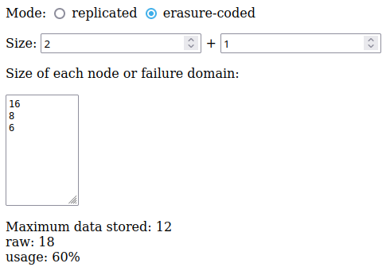

Ceph space calculator
=====================

[Open the calculator](https://github.io/ceph-capacity-calculator/)

This is a small web form where you can enter the size of each failure domain to calculate the amount of usable space in your pool.

For example, if you have set Ceph to replicate data across racks, a erasure-coded pool in 2+1 configuration, and you have 3 racks with storage capacities of 16, 8, and 6 TB. In this situation, the maximum amount of data you can store is 12 TB, which will use 18 TB of raw storage, meaning only 60% of your drives are actually usable.

